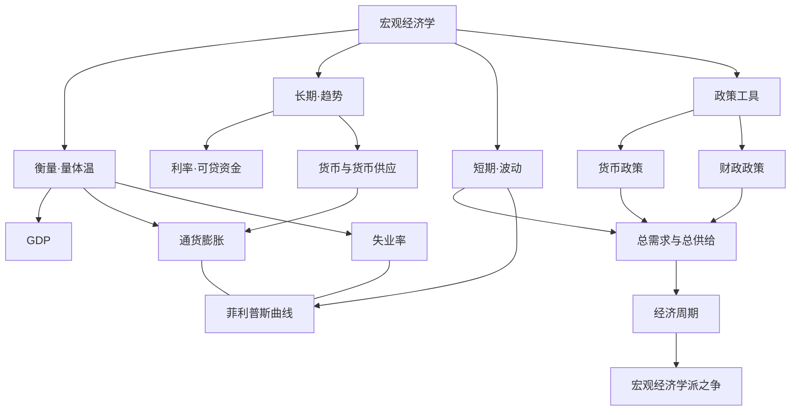

> [!summary] 一句话
> 一页串起宏观全部概念：先**量体温**（产出/物价/就业），再看**长期增长**与**短期波动**，最后是**政策**与**学派之争**。

## 总览图

## 三层结构
### 1. 衡量：先把总体量出来
- [[GDP]] —— 产出的总尺子（名义 vs 实际）。
- [[通货膨胀]] —— 物价水平（CPI）；与 [[GDP]] 一起构成"名义 vs 实际"的分野。
- [[失业率]] —— 劳动市场的松紧。

### 2. 长期：增长与货币
- [[利率]] 由可贷资金市场（储蓄=投资）决定，连接今天与未来。
- [[货币与货币供应]] 的长期增长决定 [[通货膨胀]]（货币数量论）——长期里货币是中性的。

### 3. 短期：波动与权衡
- [[总需求与总供给]]（AD–AS）决定短期产出与物价，是分析 [[经济周期]] 的主模型。
- [[菲利普斯曲线]] 描述短期 [[通货膨胀]] 与 [[失业率]] 的此消彼长。

### 4. 政策与分歧
- [[货币政策]]（央行调利率/货币量）与 [[财政政策]]（政府调支出/税收）都作用于 [[总需求与总供给|总需求]]。
- 但"该不该干预、干预是否有效"没有共识——见 [[宏观经济学派之争]]。

## 与微观的接口
宏观由无数微观个体加总而来，中间隔着"合成谬误"那道坎——详见 [[微观视角vs宏观视角]]。微观侧的全景见 [[微观经济学地图]]。

## 参见
[[宏观经济学导览]] · [[微观经济学地图]] · [[微观视角vs宏观视角]] · [[宏观经济学派之争]] · [[GDP]] · [[总需求与总供给]] · [[货币政策]] · [[通货紧缩]]
