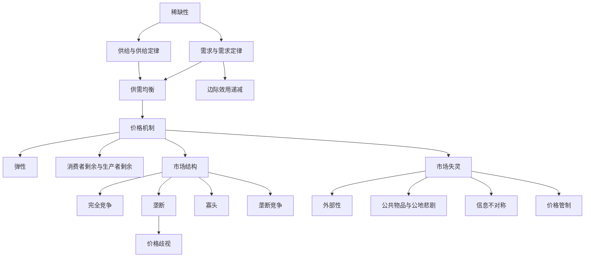

# 微观经济学地图

> [!note] 这页做什么
> 把微观经济学的核心概念串成一张图。沿着"为什么要选择 → 供需怎么形成 → 价格怎么协调 → 市场怎么分类 → 市场何时失灵"的主干，依次展开。

## 一、主干依赖关系

## 二、主干逐层展开

### 起点：为什么需要经济学
- [[稀缺性]]：资源有限、欲望无限——一切选择的根源，也是整张地图的源头。

### 第一层：供给与需求
- [[需求与需求定律]]：价格越高，需求量越少。背后是 [[边际效用递减]]——多消费一单位带来的满足递减。
- [[供给与供给定律]]：价格越高，供给量越多。

### 第二层：市场出清
- [[供需均衡]]：供给曲线与需求曲线交点，决定均衡价格与数量。

### 第三层：价格的作用
- [[价格机制]]：价格作为信号、激励与配置工具，协调分散的决策。
  - 衡量敏感度：[[弹性]]
  - 衡量交易的好处：[[消费者剩余与生产者剩余]]

## 三、分支一：市场结构

按竞争程度，从充分竞争到完全垄断排成一条谱：

- [[市场结构]]（总览）
  - [[完全竞争]]：无数小厂商、同质产品、价格接受者。
  - [[垄断竞争]]：很多厂商、产品有差异。
  - [[寡头]]：少数大厂商、相互博弈。
  - [[垄断]]：唯一卖家、有定价权。
    - 衍生策略：[[价格歧视]]（同样的东西卖不同的价）。

## 四、分支二：市场失灵

价格机制并非万能，以下情况会失灵：

- [[外部性]]：成本/收益外溢给第三方（污染、疫苗）。
- [[公共物品与公地悲剧]]：非排他、非竞争，导致供给不足或资源耗竭。
- [[信息不对称]]：买卖双方掌握信息不等（柠檬市场、逆向选择）。
- [[价格管制]]：人为设定价格上下限带来的扭曲（短缺或过剩）。

## 五、如何使用这张地图

| 你想理解… | 从这里切入 |
| --- | --- |
| 一件商品为什么涨价 | [[供需均衡]] → [[价格机制]] → [[弹性]] |
| 为什么有的行业暴利 | [[市场结构]] → [[垄断]] |
| 为什么政府要干预 | 市场失灵分支（[[外部性]] 等） |
| 一次交易划不划算 | [[消费者剩余与生产者剩余]] |

## 六、延伸阅读

- [[微观经济学导览]]：更线性的入门路径。
- [[微观视角vs宏观视角]]：微观如何加总成宏观。
- [[宏观经济学地图]]：对称的宏观全景图。
