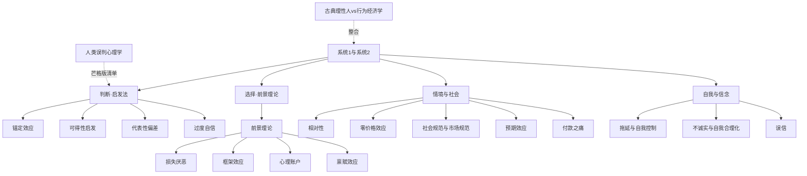

> [!summary] 一句话
> 一页串起所有偏差：底层是**两套思维机制**，往上分**判断偏差**、**选择偏差**、**情境与社会**、**自我与信念**四支，最后是**整合视角**。

## 总览图

## 五支结构
### 0. 机制根源
- [[系统1与系统2]] —— 几乎所有偏差都是系统1走捷径、系统2没及时纠偏的产物。

### 1. 判断偏差（系统1的启发法）
- [[锚定效应]]、[[可得性启发]]、[[代表性偏差]] —— 三大启发法；其叠加常导致 [[过度自信]]。

### 2. 选择偏差（前景理论家族）
- [[前景理论]] 是总框架，派生出 [[损失厌恶]]、[[框架效应]]、[[心理账户]]、[[禀赋效应]]。

### 3. 情境与社会
- [[相对性]]、[[零价格效应]]、[[社会规范与市场规范]]、[[预期效应]]、[[付款之痛]] —— 价值感如何被环境、免费、人情、预期与支付方式塑造。

### 4. 自我与信念
- [[拖延与自我控制]]、[[不诚实与自我合理化]]、[[误信]] —— 我们如何对自己食言、为作弊开脱、滑入错误信念。

### 5. 整合视角
- [[古典理性人vs行为经济学]] —— 这些偏差合起来就是对"理性人"假设的系统性修正。
- [[人类误判心理学]] —— 芒格把这些心理倾向并成一张可操作清单；多个同向叠加即 [[Lollapalooza效应]]。

> [!warning] 可重复性提醒
> 行为经济学多个效应（启动、部分锚定与诚实实验）近年面临复制危机，本库相关页已用 `> [!warning]` 标注。把这张地图当**思维清单**而非铁律。

## 参见
[[系统1与系统2]] · [[前景理论]] · [[古典理性人vs行为经济学]] · [[人类误判心理学]] · [[我该用哪个思维模型看问题]] · [[《思考，快与慢》导览]] · [[《怪诞行为学》导览]]
